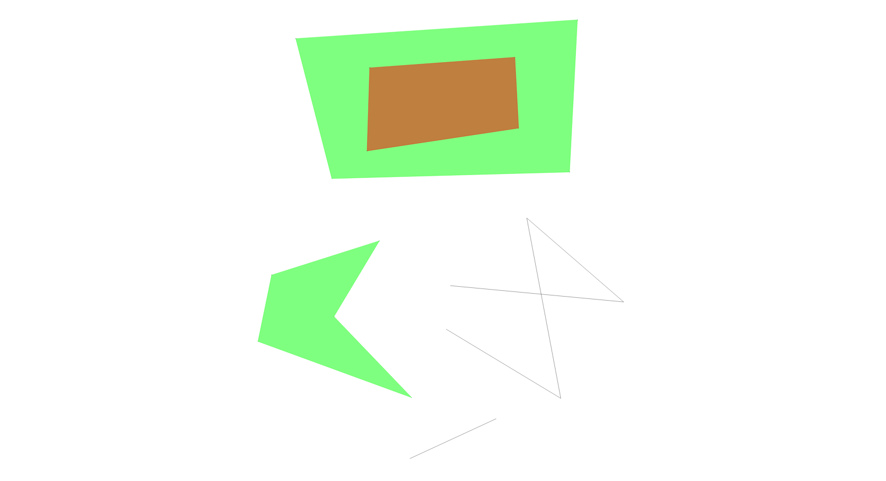

# geo-svg

This crate is a lib to generate SVG strings from [geo-types](https://docs.rs/geo-types/0.4.3/geo_types/).

[](https://crates.io/crates/geo-svg)
[](https://docs.rs/geo-svg)

Below is an example of a geometry collection rendered to SVG.



## Features

- [GeometryCollection](https://docs.rs/geo-types/0.4.3/geo_types/struct.GeometryCollection.html) and all variants of [Geometry](https://docs.rs/geo-types/0.4.3/geo_types/enum.Geometry.html) are supported
- the viewport size is automatically computed to contain all shapes

## Missing features

- no style/formatting options are available
- the stroke width is fixed which might be very inadequate for various shape size
- the public API is not stable at all and is very susceptible to go through important breaking changes

## Example

The following will show how to convert a line to a SVG string.
The [`to_svg`] method is provided by the [`ToSvg`] trait which is implemented for most [geo-types](https://docs.rs/geo-types/0.4.3/geo_types/).

```rust
use geo_types::{Coordinate, Line};
use geo_svg::ToSvg;
let point = Line::new(
    Coordinate { x: 114.19, y: 22.26 },
    Coordinate { x: 15.93, y: -15.76 },
);
println!("{}", point.to_svg());
```

### Result

```xml
<svg xmlns="http://www.w3.org/2000/svg" preserveAspectRatio="xMidYMid meet" viewBox="15.83 -15.86 98.46 38.22"><path d="M 114.19 22.26 L 15.93 -15.76" style="stroke:rgb(0,0,0);stroke-width:0.1"/></svg>
```

[`ToSvg`]: svg/trait.ToSvg.html
[`to_svg`]: svg/trait.ToSvg.html#method.to_svg
